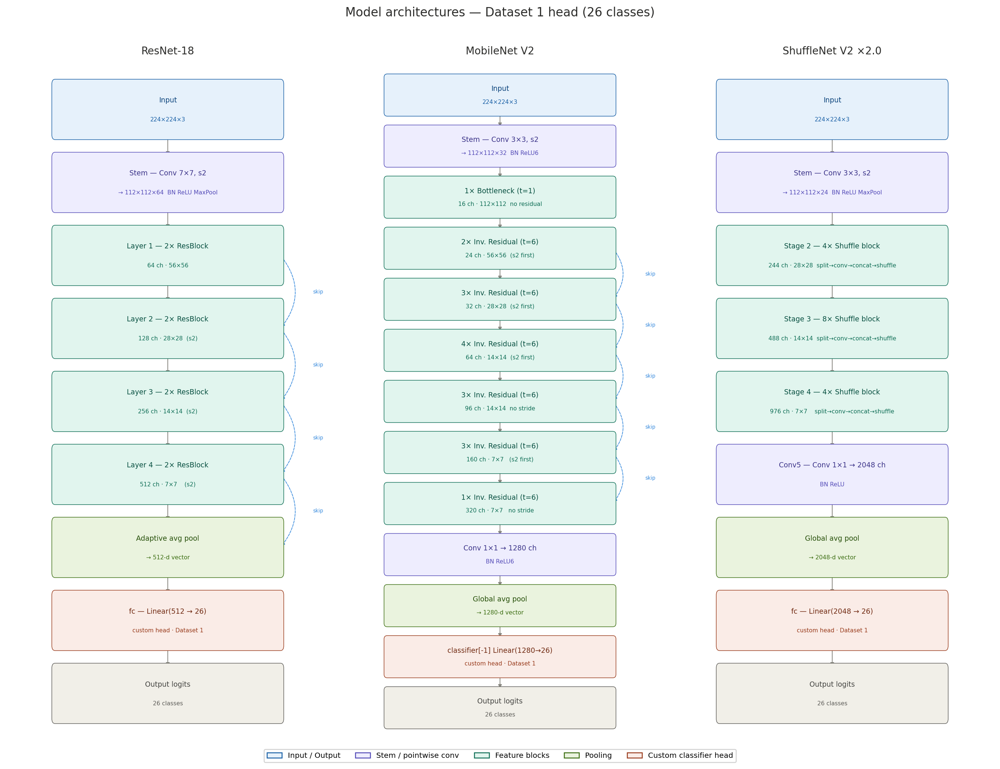

# Sign Language Classifier

In the context of Concordia's COMP-472, this project tackles communication barriers faced by the deaf community in public spaces, where limited sign language proficiency can cause exclusion. Building on neural translation research, it develops a classifier for faster, more natural interaction than written communication.

## Model Architectures

Three CNN architectures are compared, each trained both **from scratch** and via **transfer learning** (ImageNet pretrained):

| Architecture | Variant | Parameters |
|---|---|---|
| **ResNet-18** | `resnet18` | ~11M |
| **MobileNetV2** | `mobilenet_v2` | ~3.4M |
| **ShuffleNetV2 x2.0** | `shufflenet_v2_x2_0` | ~7.4M |

Each model's final classifier head is replaced with a `Linear(in_features, num_classes)` layer (with optional dropout) to match the target dataset.



## Datasets

Three ASL datasets of increasing complexity are used, sourced from Kaggle:

| Dataset | Classes | Approx. Size | Description |
|---|---|---|---|
| **Dataset 1** | 3 (A, L, Y) | ~3,000 images | Subset of ASL Alphabet |
| **Dataset 2** | 10 (a–j) | ~9,000 images | Synthetic ASL alphabet subset |
| **Dataset 3** | 36 (0–9, a–z) | ~20,000 images | Combined digits + letters |

All images are resized to 224x224 and normalized with ImageNet statistics. Data is split 80/20 train/validation.

## Notebook Structure

The notebook (`model.ipynb`) is organized into 5 sections:

1. **Environment Setup** — GPU/CPU detection, library imports, dataset download (Colab and Local variants)
2. **Data** — Loading, preprocessing, subsampling, DataLoader creation, class distribution visualization
3. **Model Training** — 12 models trained (3 architectures x 3 datasets from scratch + 3 transfer learning on Dataset 3)
4. **Evaluation & Analysis** — Accuracy, loss, confusion matrices, per-class precision/recall/F1
5. **Hyperparameter Tuning** — Ablation studies on loss functions, learning rates, schedulers, batch sizes, and dropout

## Baseline Results (10 Epochs)

| Model | Dataset | Val Accuracy | Val Loss |
|---|---|---|---|
| ResNet-18 | 1 (3 classes) | 100.00% | 0.0001 |
| MobileNetV2 | 1 (3 classes) | 100.00% | 0.0002 |
| ShuffleNetV2 | 1 (3 classes) | 100.00% | 0.0001 |
| ResNet-18 | 2 (10 classes) | 97.72% | 0.0728 |
| MobileNetV2 | 2 (10 classes) | 99.50% | 0.0161 |
| ShuffleNetV2 | 2 (10 classes) | 99.72% | 0.0147 |
| ResNet-18 | 3 (36 classes) | 98.05% | 0.0799 |
| MobileNetV2 | 3 (36 classes) | 98.00% | 0.0778 |
| ShuffleNetV2 | 3 (36 classes) | 96.79% | 0.1199 |
| ResNet-18 (TL) | 3 (36 classes) | 93.96% | 0.2062 |
| MobileNetV2 (TL) | 3 (36 classes) | 98.69% | 0.0512 |
| ShuffleNetV2 (TL) | 3 (36 classes) | 99.12% | 0.0384 |

## Hyperparameter Tuning

Ablation studies were conducted using ResNet-18 on Dataset 2 as the reference model:

- **Loss function**: CrossEntropyLoss with label smoothing (0.0, 0.05, 0.1, 0.2)
- **Learning rate**: Compared rates for from-scratch vs. transfer learning heads
- **LR schedulers**: StepLR, CosineAnnealingLR, ReduceLROnPlateau
- **Batch size**: Variations around the default of 32
- **Dropout**: Tested 0.0, 0.2, 0.4, 0.5 on the classifier head

## 2 Ways of Running the Notebook

- **Colab** (click on the link at the top of the notebook) — slower for data extraction
- **Locally** (follow the steps below) — faster for data extraction

## Local Setup Guide

### Prerequisites

- **Python 3.10+**
- **VSCode** with the [Jupyter extension](https://marketplace.visualstudio.com/items?itemName=ms-toolsai.jupyter)
- A **Kaggle account** (free) for downloading datasets

### 1. Clone the Repository

```bash
git clone https://github.com/RealBJr/sign-language-classifier.git
cd sign-language-classifier
```

### 2. Create a Virtual Environment

```bash
python -m venv .venv
```

Activate it:

- **Windows:** `.venv\Scripts\activate`
- **Mac/Linux:** `source .venv/bin/activate`

### 3. Install Dependencies

```bash
pip install -r requirements.txt
```

### 4. Set Up Kaggle Credentials

The notebook uses kagglehub to download datasets. It reads credentials from a kaggle.json file.

1. Go to [kaggle.com](https://www.kaggle.com) -> click your profile icon -> **Settings**
2. Scroll to the **API** section -> click **Create New Token**
3. This downloads a kaggle.json file that looks like:

```json
{"username":"your_username","key":"your_api_key_here"}
```

4. Place this file at:
   - ../.kaggle/kaggle.json (Under the .kaggle folder in the repo)

### 5. Open the Notebook in VSCode

1. Open the project folder in VSCode
2. Open model.ipynb
3. In the top-right corner, click **Select Kernel** -> choose your .venv Python interpreter
4. If prompted about the Jupyter extension, install it

### 6. Running the Notebook

The notebook has two parallel tracks — **Colab** sections and **Local** sections. When running locally:

- **Skip** sections labeled (Colab):
  - 1) Environment Setup (Colab)
  - 2) Data (Colab)

- **Run** sections labeled (Local):
  - 1) Environment Setup (Local) — downloads datasets via kagglehub, saves to a local SignLanguageProject/ folder, and verifies GPU access
  - 2) Data (Local) — processes all three datasets, creates DataLoaders, generates an info table, and visualizes class distributions and sample images

- **Section 3 onward** (Training, Evaluation, Hyperparameter Tuning) is shared between both environments — run as normal.

## License

This project is licensed under the MIT License. See [LICENSE](LICENSE) for details.
